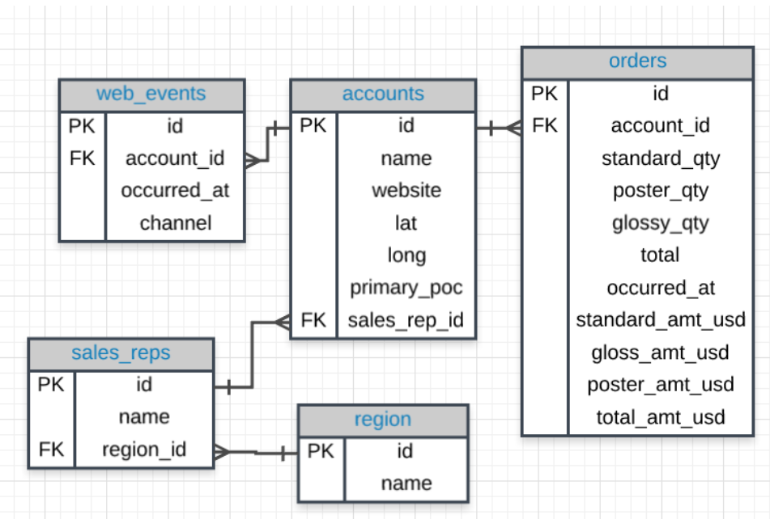

# Basic SQL

## Overview
Basic SQL Lesson Overview
In this lesson, we will cover and you will be able to:

- Describe why SQL is important
- Explain how SQL data is stored and structured
- Create SQL queries using proper syntax including

- `SELECT` & `FROM`
- `LIMIT`
- `ORDER BY`
- `WHERE`
- Basic arithmetic operations
- `LIKE`
- `IN`
- `NOT`
- `AND` & `BETWEEN` & `OR`


## Entity Relationship Diagram

An __entity-relationship diagram (ERD)__ is a common way to view data in a database. Below is the ERD for the database we will use from Parch & Posey. These diagrams help you visualize the data you are analyzing including:

The names of the tables.
The columns in each table.
The way the tables work together.



The "crow's foot" that connects the tables together shows us how the columns in one table relate to the columns in another table

## Why is SQL important

Advantages of using SQL:

1. SQL is easy to understand
1. Traditional databases allow us to access data directly
1. Traditional databases allow us to audit and replicate our data
1. SQL is great tool for analysing multiple tables at once
1. SQL allows you to analyse more complex questions than dashboards tools like Google Analytics

## Advantages of SQL

1. __Data integrity is ensured__ - only data you want to be entered is entered, only authourised users will enter data.
2. __Data can be accessed quickly__ - SQL allows you to obtain results very quickly from the DB. Code can be optimized to pull results quickly.
3. __Data is easily shared__ - multiple users can access data stored in a DB, the data is the same for all users allowing for consistent results for anyone with access to you database.

## SQL vs No SQL

These NoSQL environments tend to be particularly popular for web-based data, but less popular for data that lives in spreadsheets the way we have been analyzing data up to this point.

## Types of SQL databases

1. MySQL
2. Access
3. Oracle
4. Microsoft SQL Server
5. Postgres

[comparison of SQL lite, MYSQL, and PostgreSQL](https://www.digitalocean.com/community/tutorials/sqlite-vs-mysql-vs-postgresql-a-comparison-of-relational-database-management-systems)

## Formatting SQL queries

Use Upper and Lower cases in SQL

SQL is case insensitive

```sql
SELECT account_id
FROM orders
```

same as

```sql
select account_id
from orders
```

### Best practices

1. Capitalize all SQL commands, like `SELECT` and `FROM`, and keep everything else in your query lower case
2. Avoid spaces in Table and Variable Names
    - e.g. Table Name => table_name
3. Use white spaces
```SQL
/*good example */
 SELECT account_id FROM orders
```
```SQL
/*bad example */
SELECT              account_id

FROM               orders

```
4. Semicolons
depending on your sql environment you may need a semi colon
```sql
/*with semi colon*/
SELECT account_id
FROM orders;
```
```sql
/*without semi colon*/
SELECT account_id
FROM orders
```

## SQL Clauses

### LIMIT
The LIMIT statement is useful when you want to see just the first few rows of a table. This can be much faster for loading than if we load the entire dataset.

Always used as the last part of query.

```sql
SELECT *
FROM orders
LIMIT 10;
```

### ORDER BY

The ORDER BY statement allows us to sort our results using the data in any column

Using ORDER BY in a SQL query only has temporary effects, for the results of that query

1. First, the query sorts the results in ascending order based on the values in the column specified in the ORDER BY clause.

2. When there are multiple rows with the same value in the specified column, the query then sorts those rows based on the case sensitivity of the characters in the column values. In general, uppercase letters come before lowercase letters in the sort order.

3. When there are still multiple rows with the same value in the specified column and the same case sensitivity, the query then sorts those rows based on the numeric values of the characters in the column values.

For example, if you have a column with the following values: "B", "2", "a", "1", "C", the order in which the query would sort these values would be: "1", "2", "a", "B", "C".

__The ORDER BY statement always comes in a query after the ```SELECT``` and ```FROM``` statements, but before the ```LIMIT``` statement__

__Pro Tip__: to order descending use ```DESC``` in the  ```ORDER BY``` clause 

```sql
SELECT *
FROM orders
ORDER BY occurred_at
LIMIT 1000;
```

You can `ORDER BY` more than one column by using a `,`

```sql
SELECT *
FROM orders
ORDER BY occurred_at, total_amt_usd DESC
LIMIT 1000;
```

__Pro Tip__: to remove the case sensitivity when ordering use LOWER or UPPER

```sql
SELECT *
FROM orders
ORDER BY LOWER(name)
```

__Pro Tip__: you can use numbers in an `ORDER BY`

```sql
SELECT name, occurred_at, location
FROM orders
ORDER BY 2, 3
```

### WHERE

Using the WHERE statement, we can display subsets of tables based on conditions that must be met. You can also think of the WHERE command as filtering the data.

Common symbols used in WHERE statements include:

- ```>``` (greater than)
- ```<``` (less than)
- ```>=``` (greater than or equal to)
- ```<=``` (less than or equal to)
- ```=``` (equal to)
- ```!=`` (not equal to)

```sql
SELECT *
FROM orders
WHERE account_id = 4251
ORDER BY occurred_at
LIMIT 1000;
```

#### IN

The ```IN``` operator is useful for working with both numeric and text columns. This operator allows you to use an =, but for more than one item of that particular column

```sql
SELECT *
FROM orders
WHERE account_id IN (1001,1021);
```

#### NOT

The NOT operator is an extremely useful operator for working with the previous two operators we introduced: ```IN``` and ```LIKE```. By specifying ```NOT LIKE``` or ```NOT IN```, we can grab all of the rows that do not meet particular criteria.

NOT IN example
```sql
SELECT sales_rep_id, 
       name
FROM accounts
WHERE sales_rep_id NOT IN (321500,321570)
ORDER BY sales_rep_id
```

NOT LIKE example
```sql
SELECT *
FROM accounts
WHERE website NOT LIKE '%com%';
```

#### LIKE

The ```LIKE``` operator is used to check a specific character or unknown length of characters when searching through text.

The `pattern` can contain two special wildcard characters:

`%` - represents any number of characters
`_` - represents a single character

- Example 1: Select all the customers whose name starts with the letter 'A'
```sql
SELECT * FROM customers
WHERE customer_name LIKE 'A%';
```
- Example 2: Select all the products whose name contains the word 'chocolate'
```sql
SELECT * FROM products
WHERE products LIKE '%chocolate%'
```
- Example 3: Select all the orders with order number starting with 'OD' and ending with '8'
```sql
SELECT *
FROM products
WHERE name LIKE 'OD%8'
```
- Example 4: Select all the customers whose name is exactly 5 characters long and ends with 's'
```sql
SELECT *
FROM products
WHERE name LIKE '_____s'
``` 

### Logical Operators

#### AND

`AND` operator is used within the `WHERE` clause.

It is used to combine logical clauses together.

```sql
WHERE column >= 6 AND column <= 10
```

#### BETWEEN

`BETWEEN` operatoris used for when we want to be between two values

```sql
WHERE column BETWEEN 6 AND 10
```

__Pro Tip__: for Dates you put the start date and then a day after the end date beacuse the boundary is at 12am

```sql
/* dates in the year of 2016 */
SELECT *
FROM orders
WHERE occurred_at BETWEEN '2016-01-01' AND '2017-01-01` 
```