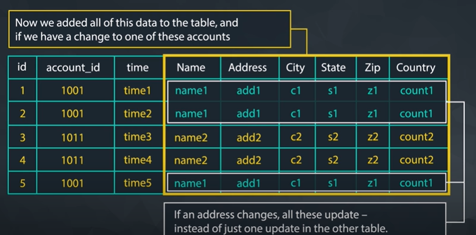

# SQL JOINs

In this lesson you will be:

- Creating Joins
- Using Primary - Foreign Keys
- Integrating Aliases
- Evaluating Various Join Types
- Integrating Filters with Joins

## Why should we split up the data into different tables

1. Easier to organise data into logical tables (content/data management)
2. Optimization of execution
    - number and type of calculations add to the execution time
    - prevent redundant data if you put the tables all together
    


## Database Normalization

Process of organizing a relational database in such a way that it reduces data redundancy and improves data integrity.

There are essentially three ideas that are aimed at database normalization:

- Are the tables storing logical groupings of the data?
- Can I make changes in a single location, rather than in many tables for the same information?
- Can I access and manipulate data quickly and efficiently?

## Normal Forms
1. First normal form (1NF): Each table should have a primary key and all columns in the table should be atomic (indivisible).

2. Second normal form (2NF): All non-key attributes should be fully dependent on the primary key.

3. Third normal form (3NF): All non-key attributes should be dependent only on the primary key, and not on any other non-key attributes.

[aricle on why we need SQL normalization](SQL by Design: Why You Need Database Normalization)

## JOINs

`JOIN` is a way to combine data from two or more tables. These are usually done through a `primary key` to a `foriegn key` but it can be to **any columns** that have same values.

### Primary Key

A primary key is a column or a set of columns in a relational database table that uniquely identifies each row in the table

It is used to enforce data integrity and ensure that there are no duplicate or null values in the column(s) designated as the `primary key`.

A primary key can be a single column or a combination of columns. When a primary key is defined on multiple columns, it is called a `composite primary` key

1. Uniqueness: Each value in the primary key column(s) must be unique.
2. Non-nullability: The primary key column(s) cannot contain null values.
3. Irreducibility: The primary key column(s) must be irreducible, meaning it should not be possible to remove any part of the primary key and still have a unique identifier for each row in the table.

### Foreign Key

In SQL (Structured Query Language), a foreign key is a field or combination of fields in a table that refers to the primary key of another table. It establishes a relationship between two tables by ensuring that the values in the foreign key column(s) of one table match the values in the primary key column(s) of another table.

### Syntax

We use ON clause to specify a JOIN condition which is a logical statement to combine the table in FROM and JOIN statements.

Example to get __all__ columns from the tables `orders` and `accounts`

```sql
SELECT orders.*,
       accounts.*
FROM orders 
JOIN accounts
ON orders.account_id = accounts.id;
```

Example to get __specific__ columns from the tables `orders` and `accounts`

```sql
SELECT orders.id, orders.total,
       accounts.id
FROM orders 
JOIN accounts
ON orders.account_id = accounts.id;
```

Example to `JOIN` multiple tables

Provide a table that provides the region for each sales_rep along with their associated accounts. Your final table should include three columns: the region name, the sales rep name, and the account name. Sort the accounts alphabetically (A-Z) according to account name.

```sql
SELECT r.name region, s.name rep, a.name account
FROM sales_reps s
JOIN region r
ON s.region_id = r.id
JOIN accounts a
ON a.sales_rep_id = s.id
ORDER BY a.name;
```

### Alias

```sql
Select t1.column1 aliasname, t2.column2 aliasname2
FROM tablename AS t1
JOIN tablename2 AS t2
```

### Types of JOINs


If there is not matching information for `LEFT` and `RIGHT` `JOINS` in the JOINed table, then you will have columns with empty cells. These empty cells introduce a new data type called NULL

LEFT JOIN
```sql
SELECT a.id, a.name, o.total
FROM accounts a
LEFT JOIN orders o
ON a.id = o.account_id
```

RIGHT JOIN
```sql
SELECT a.id, a.name, o.total
FROM accounts a
RIGHT JOIN orders o
ON a.id = o.accounts_id
```

__Side Note: These are the same__

```LEFT OUTER JOIN``` and ```LEFT JOIN```

```RIGHT OUTER JOIN```and ```RIGHT JOIN```

```FULL OUTER JOIN``` and ```OUTER JOIN```
