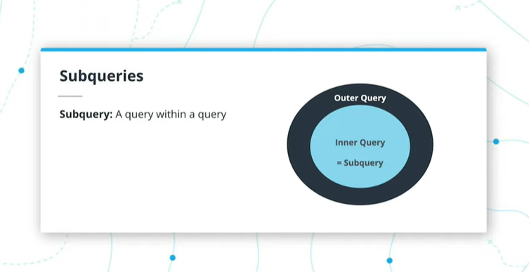
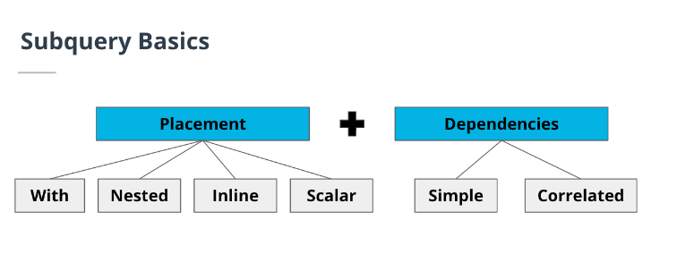
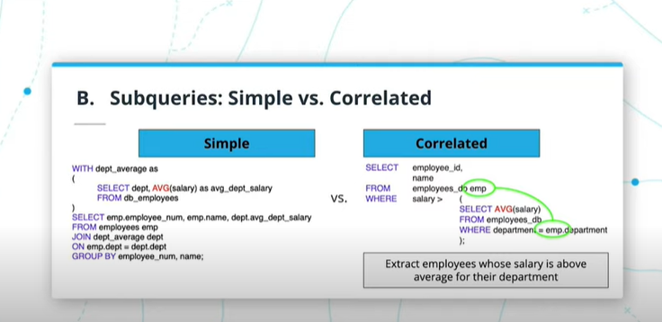

# Sub queries and Temp tables

Subquery: a query that runs within an outer query




```sql
SELECT product_id,
       name,
       price
FROM db.product
Where price > (SELECT AVG(price) FROM db.product) -- right part is subquery
```

## When do you need a subquery?

- manipulating an existing table to "pseudo-create" a table which is used as part of a larger query

Example of when to use subqueries

- Identify the top-selling Amazon products in months where sales have exceeded $1m
    - Existing Table: Amazon daily sales
    - Subquery Aggregation: Daily to Monthly
- Examine the average price of a brand’s products for the highest-grossing brands
    - Existing Table: Product pricing data across all retailers
    - Subquery Aggregation: Individual to Average
- Order the annual salary of employees that are working less than 150 hours a month
    - Existing Table: Daily time-table of employees
    - Subquery Aggregation: Daily to Monthly


## Subqueries VS JOINs

|Factor|Subquery|Join|
|------|-----|--------|
|Use cases|When an existing table needs to be manipulated or aggregated to then be joined to a larger table.|A fully flexible and discretionary use case where a user wants to bring two or more tables together and select and filter as needed.|
|Syntax|A subquery is a query within a query. The syntax, as a result, has multiple SELECT and FROM clauses.|A join is simple stitching together multiple tables with a common key or column. A join clause cannot stand and be run independently|
|Dependencies|A subquery clause can be run completely independently. When trying to debug code, subqueries are often run independently to pressure test results before running the larger query.|A join clause cannot stand and be run independently.|
|Output|Both subqueries and joins are essentially bringing multiple tables together (whether an existing table is first manipulated or not) to generate a single output.|Same as previous cell to the left|
|Deep Dive Topics|What happens under the hood: Query plans are similar for both subqueries and joins, read this [link](https://www.essentialsql.com/what-is-a-query-plan/)|Same as previous cell to the left|

## Subquery Basics



- Must be fully placed inside paranthesis
- Must be fully independent and can be executed on their own (except Correlated subqueries)
- Two components of subqueries
    1. Placement - Where it is placed
        - With
            - also known as a common table expression (CTE)
            - allows you to define a temporary named result set that can be referenced multiple times within a larger query
            - common use case is to simplify complex queries or create a temp table with limited rows to improve performance
            ```sql
            WITH top_paid_employees AS (
                SELECT employee_id, first_name, last_name, salary
                FROM employees
                ORDER BY salary DESC
                LIMIT 10
            )
            SELECT e.employee_id, e.first_name, e.last_name, e.department_id, tpe.salary
            FROM employees e
            JOIN top_paid_employees tpe
            ON e.employee_id = tpe.employee_id;
            ```
        - Nested
            - A nested subquery is a subquery that is embedded within another subquery or the main query
            ```sql
            SELECT department_name
            FROM departments d
            WHERE department_id IN (
                SELECT department_id
                FROM employees
                GROUP BY department_id
                HAVING COUNT(*) > 5
            );
            ```
        - Inline
            - This subquery is used in the same fashion as the WITH use case above. However, instead of the temporary table sitting on top of the larger query, it’s embedded within the from clause.
            ```sql
            SELECT student_name
            FROM
                (SELECT student_id, student_name, grade
                FROM student
                WHERE teacher =10)
            WHERE grade >80;
            ```
        - Scalar
            - A scalar subquery is a subquery that returns a single value, which can be used as part of an expression in the main query
            ```sql
            SELECT employee_id, first_name, last_name, salary,
            (SELECT MIN(salary) FROM employees) AS min_salary
            FROM employees;
            ```
    2. Dependencies - with the outer/larger query
        - Simple - The inner subquery is completely independent of the larger query.
        - example 1
        ```sql
        WITH dept_average AS 
        (SELECT dept, AVG(salary) AS avg_dept_salary
        FROM employee
        GROUP BY employee.dept
        )
        SELECT E.eid, E.ename, D.avg_dept_salary
        FROM employee E
        JOIN dept.average D
        ON E.dept = D.dept
        WHERE E.salary > D.avg_dept_salary
        ```
        - Correlated - The inner subquery is dependent on the larger query.
        - example 1
        ```sql
        SELECT employee_id, name
        FROM employees_db emp
        WHERE salary > 
            (SELECT AVG(salary)
            FROM employees_db
            WHERE department = emp.department
            );
        ```
        - example 2 (pretty sure you can do this with a groupby)
        ```sql
        SELECT first_name, last_name, (
                 SELECT AVG(GPA)
                 FROM outer_db
                 WHERE university = outer_db.university) GPA, university
        FROM student_db outer_db;
        ```
        - example 3
        ```sql
        SELECT first_name, last_name, GPA, university
        FROM student_db outer_db
        WHERE GPA >
                        (SELECT AVG(GPA)
                        FROM student_db
                        WHERE university = outer_db.university);
        ```

picture that shows how correlated queries are linked from outer to inner query



## SQL Views

- Views are virtual tables that are derived from one or more base tables.
- The term virtual means that the views do not exist physically in a database, instead, they reside in the memory (not database), just like the result of any query is stored in the memory.

Syntax for creating a view

```sql
CREATE VIEW <VIEW_NAME>
AS
SELECT …
FROM …
WHERE …
```

```sql
CREATE VIEW v1
AS
SELECT S.id, S.name AS Rep_Name, R.name AS Region_Name
FROM sales_reps S
JOIN region R
ON S.region_id = R.id
AND R.name = 'Northeast';
```

Can we update the base tables by updating a view?

- Since views do not exist physically in the database, it is may or may not be possible to execute UPDATE operations on views. 
- It depends on the SELECT query used in the view definition. 
- Generally, if the SELECT statement contains either an AGGREGATE function, GROUPING, or JOIN, then the view may not update the underlying base tables.

Can we insert or delete a tuple in the base table by inserting or deleting a tuple in a view?

- Again, it depends on the view definition. If a view is created from a single base table, then yes, you can insert/delete tuples by doing so in the view.

Can we alter the view definition?

- Most of the databases allow you to alter a view. For example, Oracle and IBM DB2 allows us to alter views and provides CREATE OR REPLACE VIEW option to redefine a view.
```sql
CREATE OR ALTER VIEW my_view AS
SELECT column1, column2, column3, column4
FROM my_table
WHERE column5 = 'new value';
```

## Subquery tradeoffs

1. ___Readability___: How easy it is to determine what the code is doing
2. ___Performance___: How quickly the code runs
3. ___Query Plan___: What happens under the hood

[link](https://dev.mysql.com/doc/refman/8.0/en/optimization.html) for a good guide to sql optimization


## Subquery strategy

1. Determine if a subquery is needed (or a join/aggregation function will suffice).
2. If a subquery is needed, determine where you’ll need to place it.
3. Run the subquery as an independent query first: is the output what you expect?
4. Call it something! If you are working with With or Inline subquery, you’ll most certainly need to name it.
5. Run the entire query -- both the inner query and outer query.