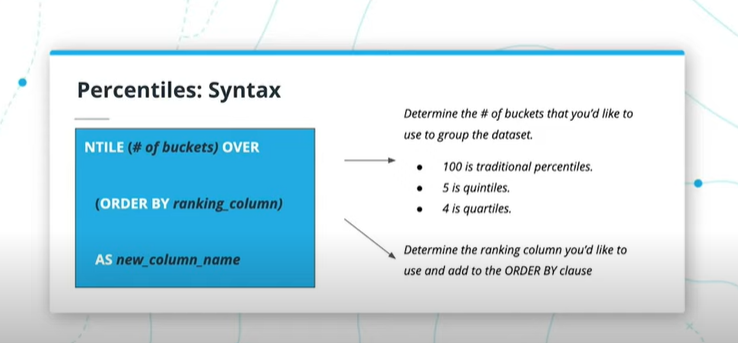
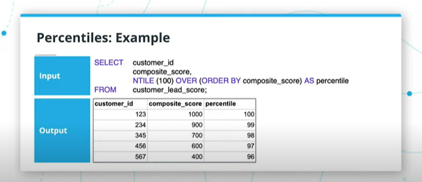

# SQL Window Functions

## Introdution

In this lesson, we will cover window functions. Window functions are primarily used in two ways:

1. To understand a running total or a running metric while maintaining individual records
2. To rank a dataset

At the end of this lesson, you will be able to create windows functions using:

- Core Functions
- Ranking Functions
- Advanced Functions

## When to use window functions

1. When you want to measure trends or changes over rows or records in your data
2. When you want to rank a column for outreach or prioritization

- Measuring changes over time
- Has the average price of airline tickets gone up this year
- Whats the best way to keep the running total orders of customers
- The ranking used for outreach prioritization:
    - Use a combinationof factors to rank companies most likely to need a loan

## Terms

- Partition by: A subclause of the OVER clause. Similar to GROUP BY.
- Over: Typically precedes the partition by that signals what to “GROUP BY”.
- Aggregates: Aggregate functions that are used in window functions, too (e.g., sum, count, avg).
- Row_number(): Ranking function where each row gets a different number.
- Rank(): Ranking function where a row could get the same rank if they have the same value.
- Dense_rank(): Ranking function similar to rank() but ranks are not skipped with ties.
- Aliases: Shorthand that can be used if there are several window functions in one query.
- Percentiles: Defines what percentile a value falls into over the entire table.
- Lag/Lead: Calculating differences between rows’ values.

## Syntax

```sql
AGGREGATE_FUNCTION(column_1) OVER
    (PARTITION BY column_2 ORDER BY column_3)
    AS new_column_name
```
1. An aggregation function (e.g., sum, count, or average) + the column you’d like to track
2. OVER
3. PARTITION BY + the column you’d like to “group by”
4. ORDER BY (optional and is often a date column)
5. AS + the new column name

[useful link](https://blog.sqlauthority.com/2015/11/04/sql-server-what-is-the-over-clause-notes-from-the-field-101/)

## GROUP BY vs PARTITION BY

|GROUP BY|PARTITION BY|
|--------|------------|
|The output has a lessened # of records based on the group by column| The output maintains the # of records in the original table|
|The output is one row per group by in the results set| If the original table had 10 rows, the partition by will maintain 10 rows|

___Note___: You can't use a window function and standard aggregations in the same query. you can’t include window functions in a GROUP BY clause.

```sql
SELECT order_id,
       order_total,
       order_price,
       SUM(order_total) OVER
           (PARTITION BY month(order_date) ORDER BY order_date) AS running_monthly_sales,
       COUNT(order_id) OVER
           (PARTITION BY month(order_date) ORDER BY order_date) AS running_monthly orders,
       AVG(order_price) OVER
           (PARTITION BY month(order_date) ORDER BY order_date) AS average_monthly_price
FROM  amazon_sales_db
WHERE order_date < '2017-01-01';
```

## Ranking Window Functions

- `ROW_NUMBER()`: Ranking is ___distinct amongst records___ even with ties in what the table is ranked against
- `RANK()`: The ___same amongst tied values___ and ___rank skip___ for subsquent values
- `DENSE_RANK()`: Ranking is the ___same amongst tied___ values and ranks ___do not skip___ for subsquent values


|name|score|row_num|rank|dense_rank|
|----|-----|-------|----|----------|
|Charlie|90|1|1|1|
|Emily|90|2|1|1|
|Bob|85|3|3|2|
|Dave|85|4|3|2|
|Alice|80|5|5|3|
|Frank|75|6|6|4|

```sql
SELECT name, score, ROW_NUMBER() OVER (ORDER BY score DESC) as row_num,
       RANK() OVER (ORDER BY score DESC) as rank,
       DENSE_RANK() OVER (ORDER BY score DESC) as dense_rank
FROM students;
```

## Alias for window functions

- A monthly_window alias function is defined at the end of the query in the WINDOW clause.
- It is then called on each time an aggregate function is used within the SELECT clause.

syntax

```sql
/* previous sql code */
SELECT AGGREGATE_FUNCTION(column) OVER monthly_windows AS column_name
WHERE ...
WINDOW monthly_window AS
       (PARTITION BY month(order_date) ORDER BY order_date);
```

```sql
SELECT order_id,
       order_total,
       order_price,
       SUM(order_total) OVER monthly_window AS running_monthly_sales,
       COUNT(order_id) OVER monthly_window AS running_monthly orders,
       AVG(order_price) OVER monthly_window AS average_monthly_price
FROM   amazon_sales_db
WHERE  order_date < '2017-01-01'
WINDOW monthly_window AS
       (PARTITION BY month(order_date) ORDER BY order_date);
```

## LAG

syntax

```sql
SELECT LAG(column_name) OVER (ORDER BY column_name) AS lag
```

```sql
SELECT account_id, 
       standard_sum,
       LAG(standard_sum) OVER (ORDER BY standard_sum) AS lag
       standard_sum - LAG(standard_sum) OVER (ORDER BY standard_sum) AS lag_difference
FROM   (
        SELECT   account_id, SUM(standard_qty) AS standard_sum
        FROM     orders
        GROUP BY 1
       ) sub
```

## LEAD

syntax

```sql
SELECT LEAD(column_name) OVER (ORDER BY column_name) AS lead
```

```sql
SELECT account_id, 
       standard_sum,
       LEAD(standard_sum) OVER (ORDER BY standard_sum) AS lead
       standard_sum - LEAD(standard_sum) OVER (ORDER BY standard_sum) AS lead_difference
FROM   (
        SELECT   account_id, SUM(standard_qty) AS standard_sum
        FROM     orders
        GROUP BY 1
       ) sub
```

## Percentiles NTILE






Syntax

```sql
SELECT NTILE(# of buckets) OVER (ORDER BY ranking_columns) AS new_column_name
```

Example

```sql
-- NTILE(# of buckets) OVER (ORDER BY ranking_column) AS new_column_name

SELECT  customer_id,
        composite_score,
        NTILE(100) OVER(ORDER BY composite_score) AS percentile
FROM    customer_lead_score;
```

Example - get each quartile for each account_id

```sql
SELECT
       account_id,
       occurred_at,
       standard_qty,
       NTILE(4) OVER (PARTITION BY account_id ORDER BY standard_qty) AS standard_quartile
  FROM orders 
 ORDER BY account_id DESC
```