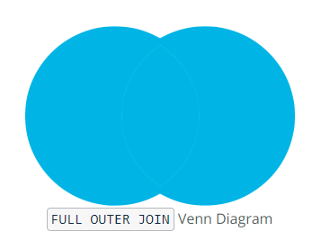

# SQL Advanced JOINs and Performance Tuning

- Create fast-running queries with advanced joins
- Evaluate business questions
- Tune the performance of queries
- Create solutions for edge-cases

## FULL OUTER JOIN



```sql
SELECT column_name(s)
FROM Table_A
FULL OUTER JOIN Table_B ON Table_A.column_name = Table_B.column_name;
```

## RETURN ALL UNMATCHED ROWS


```sql
SELECT column_names(s)
FROM Table_A AS ta
FULL OUTER JOIN Table_B AS tb
ON ta.id = tb.id
WHERE ta.id IS NULL OR tb.id IS NULL
```

```sql
SELECT a.id AS accounts_id, sr.id AS sales_rep_id
FROM accounts as a
FULL OUTER JOIN sales_reps as sr
ON a.sales_rep_id = sr.id
WHERE a.id IS NULL OR sr.id IS NULL
```

## JOINs with Comparison Operators

__Pro Tip__: If you recall from earlier lessons on joins, the join clause is evaluated before the where clause -- filtering in the join clause will eliminate rows before they are joined, while filtering in the WHERE clause will leave those rows in and produce some nulls.

```sql
SELECT accounts.name as account_name,
       accounts.primary_poc as poc_name,
       sales_reps.name as sales_rep_name
  FROM accounts
  LEFT JOIN sales_reps
    ON accounts.sales_rep_id = sales_reps.id
   AND accounts.primary_poc < sales_reps.name
```

## Self JOINs

```sql
SELECT o1.id AS o1_id,
       o1.account_id AS o1_account_id,
       o1.occurred_at AS o1_occurred_at,
       o2.id AS o2_id,
       o2.account_id AS o2_account_id,
       o2.occurred_at AS o2_occurred_at
FROM   orders o1
LEFT JOIN orders o2
ON     o1.account_id = o2.account_id
AND    o2.occurred_at > o1.occurred_at
AND    o2.occurred_at <= o1.occurred_at + INTERVAL '28 days'
ORDER BY o1.account_id, o1.occurred_at
```

### UNION

- The `UNION` operator is used to combine the result sets of 2 or more SELECT statements. It removes duplicate rows between the various SELECT statements.
- Each SELECT statement within the `UNION` must have the same number of fields in the result sets with similar data types.
- Typically, the use case for leveraging the `UNION` command in SQL is when a user wants to pull together distinct values of specified columns that are spread across multiple tables. For example, a chef wants to pull together the ingredients and respective aisle across three separate meals that are maintained within different tables.

syntax

- there must be the same number of expressions in both `SELECT` statements
- corresponding expression myst have the same data type in the `SELECT` statements

___ProTip__

- `UNION` remove duplicate rows
```sql
SELECT *
FROM web_events
UNION
SELECT *
FROM web_events_2
```
- `UNION ALL` does not remove duplicate rows
```sql
SELECT *
FROM web_events
UNION ALL
SELECT *
FROM web_events_2
```

[useful link on sql unions](https://www.techonthenet.com/sql/union.php)

## Perfomance tuning

what are the things that affect performance

- Table Size
- Joins
- Aggregations
- Other users running queries concurrently on the DB
- DB software and optimization (e.g. POSTGRES is optimized different than REDSHIFT)

### LIMIT in a subquery if you can

LIMIT happens afer the aggregations and group by so if you want to limit the table you should use a sub query


This will not save time

```sql
SELECT SUM(poster_qty) AS sum_poster_qty
FROM orders
WHERE occurred_at >= '2016-01-01'
AND occurred_at < '2016-07-01'
LIMIT 10
```

This will save time

```sql
SELECT account_id,
       SUM(poster_qty) AS sum_poster_qty
FROM   (SELECT * FROM orders LIMIT 10) sub
WHERE  occurred_at >= '2016-01-01'
AND    occurred_at < '2016-07-01'
GROUP BY 1
```

### Reduce the number of rows to join

The second thing you can do is to make joins less complicated, that is, reduce the number of rows that need to be evaluated. It is better to reduce table sizes before joining them.

This can be done using a sub query


non performant

```sql
SELECT accounts.name,
       COUNT(*) AS web_events
FROM accounts
JOIN web_events events
ON events.account_id = accounts.id
GROUP BY 1
ORDER BY 2 DESC
```

performant
```sql
SELECT a.name,
       sub.web_events
FROM   (SELECT account.id,
       COUNT() AS web_events
       FROM web_events
        GROUP BY 1) sub
JOIN   accounts a 
ON     a.id = sub.account_id
ORDER BY 2 DESC
```

### Use EXPLAIN

Adding the command EXPLAIN at the beginning of any query allows you to get a sense of how long it will take your query to run. it will output a query plan.

The query plan will attach a cost to the query and the higher the cost, the longer the runtime. EXPLAIN is most useful to identify and modify those steps that are expensive

```sql
EXPLAIN
SELECT *
FROM   web_events
WHERE  occurred_at >='2016-01-01'
AND    occurred_at < '2016-02-01'
```

```
-- output of query plan
Limit (cost=0.00..69.68 rows=100 width=23)
-> Seq Scan on web_events (cost=0.00..195.09 rows=280 width=23)
Filter: ((occurred_at >= '2016-01-01 00:00:00'::timestamp without time zone) AND (occurred_at < '2016-02-01 00:00:00'::timestamp without time zone))
```

```sql
EXPLAIN
SELECT *
FROM   web_events
WHERE  occurred_at >='2016-01-01'
AND    occurred_at < '2016-02-01'
LIMIT 100
```